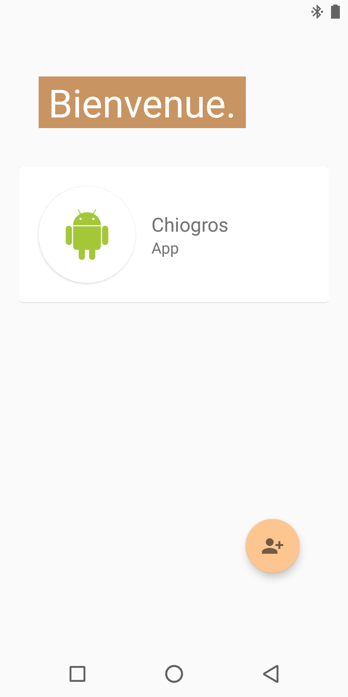
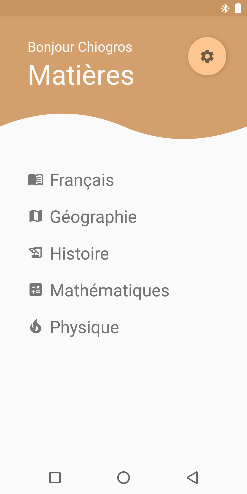
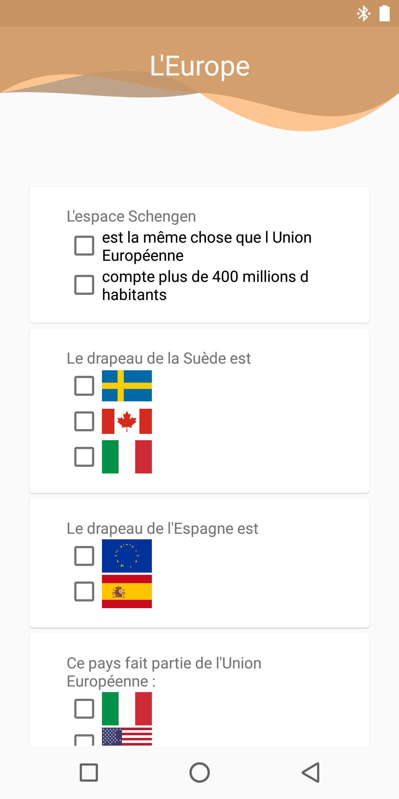
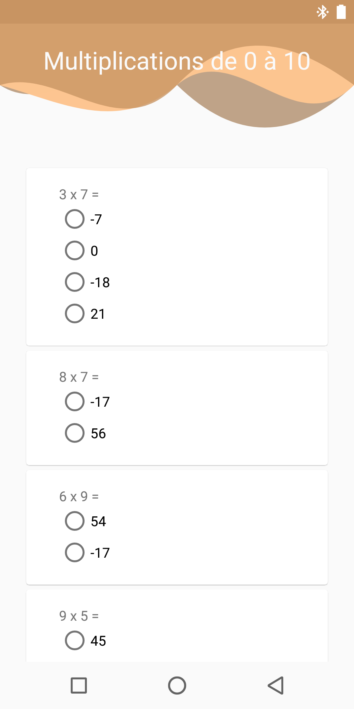

# Loustics
A simple multi-themed quizz for an Android college project.

There are a few courses : French, Geography, History and Math.
For each theme, there are multiple chapters that brings different questions.

  
  
  
  

All the questions are stored in a database.
To add / edit / remove some questions, you should check in `java/.../db/AppDatabase.java`
You can set multiple answers for a question: as much rights and wrongs answers as you want.
Theses answers are parsed in JSON in two arrays : `right` and `wrong`.
